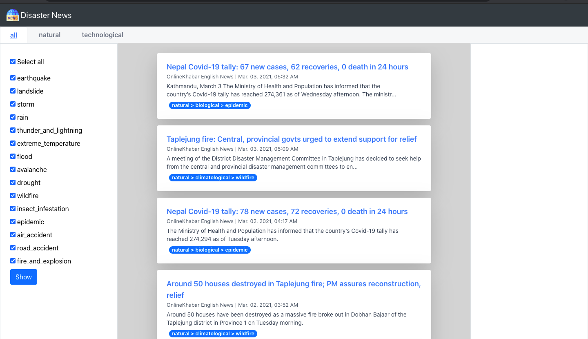
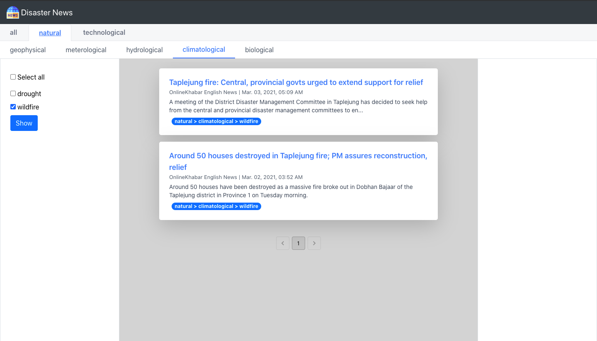
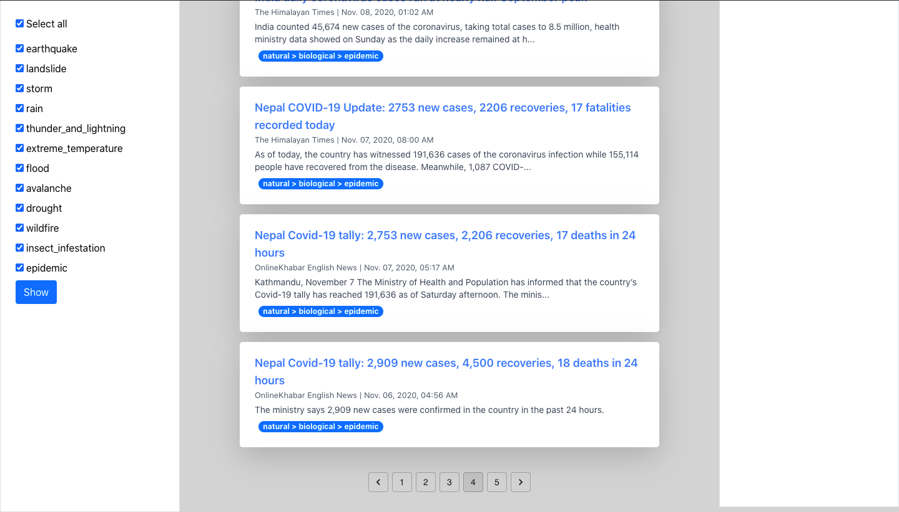

# Disaster-News-Aggregation-and-Hierarchical-Classification

### In this project, disaster news are filtered out from mainstream news media, and are shown in a web application in a hierarchical category. 

To run the app in a local development environment:

First clone this repo.
  
  ```
cd Disaster-News-Aggregation-and-Hierarchical-Classification`
```

Terminal 1:

  ```
  cd backend/major_webapp
  
  python3 -m venv env
  
  source ./env/bin/activate
  
  pip3 install -r requirements.txt
  
  python3 manage.py runserver
```
  
Terminal 2:

  ```
  cd frontend
  
  npm init
  
  npm install
  
  npm start
```
  
Open http://localhost:3000 to view it in the browser. You wil see something like the following screenshots:
  




